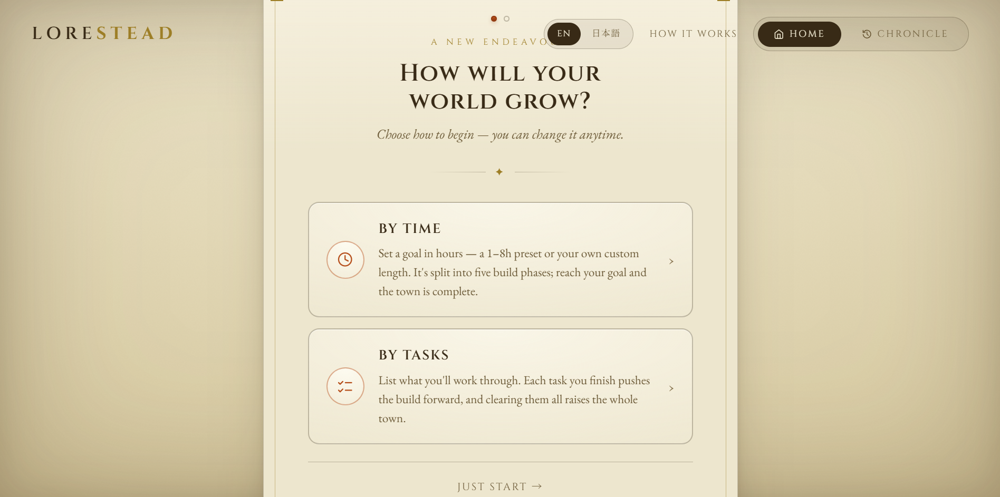
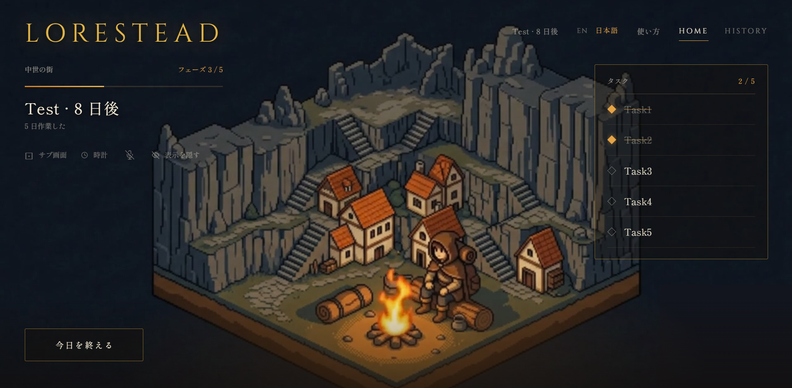
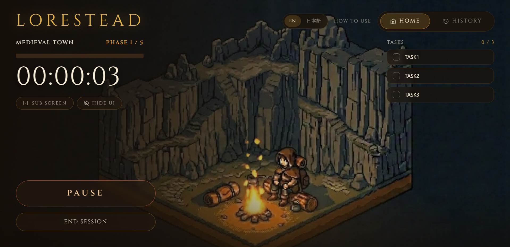

# LORESTEAD

> 勉強・作業時間やタスク完了に応じて中世の街が育つ、没入型の生産性タイマーアプリ


---


---

## 概要

Loresteadは、集中タイマーと「世界育成」のゲーム体験を融合させたWebアプリです。セッション開始時に成長モードを選び、タイマーを動かすたびに画面いっぱいに広がる中世の街が5段階で進化します。ログイン不要・完全クライアントサイドで動作します。

## スクリーンショット

| セットアップ | メイン画面 |
|---|---|
|  |  |

| タスクモード |  |
|---|---|
|  | |

## 機能

### 3つの成長モード

| モード | 成長条件 |
|---|---|
| **時間で成長** | 目標時間を設定し、達成度に応じて5段階進化 |
| **タスクで成長** | ToDoリストを作成し、完了数に応じて進化 |
| **フリー** | 設定不要。1時間ごとに自動で1段階成長（4時間で完成） |

### その他の機能

- **5段階の世界進化** — 中世の街がアニメーション動画で段階的に変化
- **セットアップウィザード** — 初回起動時のガイドツアーで直感的にモードを選択
- **タイムラプス生成** — セッション中の作業画面をキャプチャしてMP4として保存・ダウンロード
- **Picture-in-Picture** — 他のタブで作業しながらタイマーをフローティング表示
- **Hide UI** — UIを非表示にして世界動画だけを全画面表示
- **Chronicle（履歴）** — 過去セッションのタイムラプスをローカルに保存・閲覧
- **日英対応** — EN / JP 切り替え

## 技術スタック

| 項目 | 技術 |
|---|---|
| フレームワーク | React 19, TypeScript |
| ビルド | Vite 8 |
| スタイル | Tailwind CSS 4 |
| データ保存 | IndexedDB（タイムラプス・フレーム） |
| ブラウザAPI | MediaRecorder, getDisplayMedia, documentPictureInPicture |
| ホスティング | Vercel |

## セットアップ

```bash
cd frontend
npm install
npm run dev
```

## 使い方

1. 初回起動時に**言語選択** → **成長モード選択**（セットアップウィザード）
2. **START** でタイマー開始、街が動き始める
3. タスクモードの場合は右側のチェックリストをこなすと街が進化
4. **END SESSION** でセッション終了 → タイムラプス生成 → 履歴に保存
5. **HISTORY** タブで過去のタイムラプスを閲覧・ダウンロード

## ライセンス

MIT
